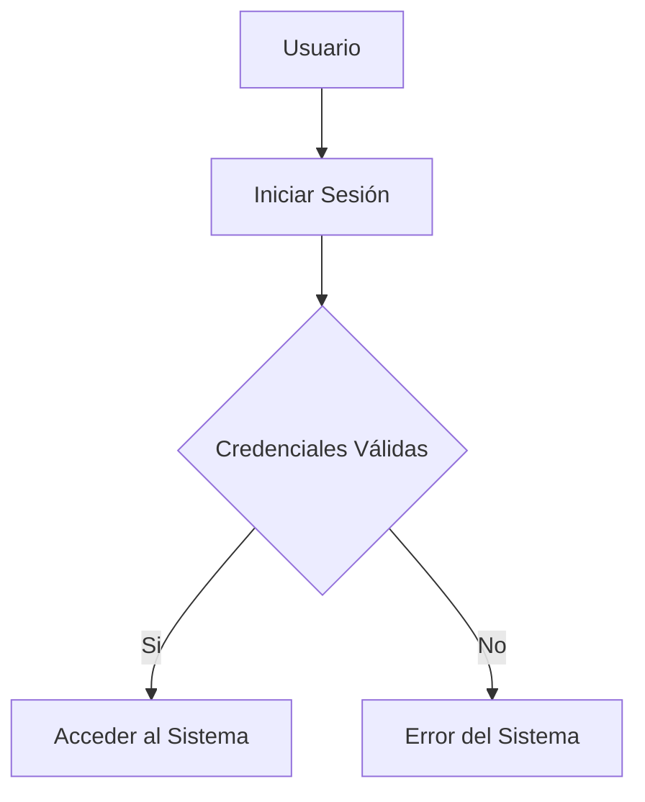
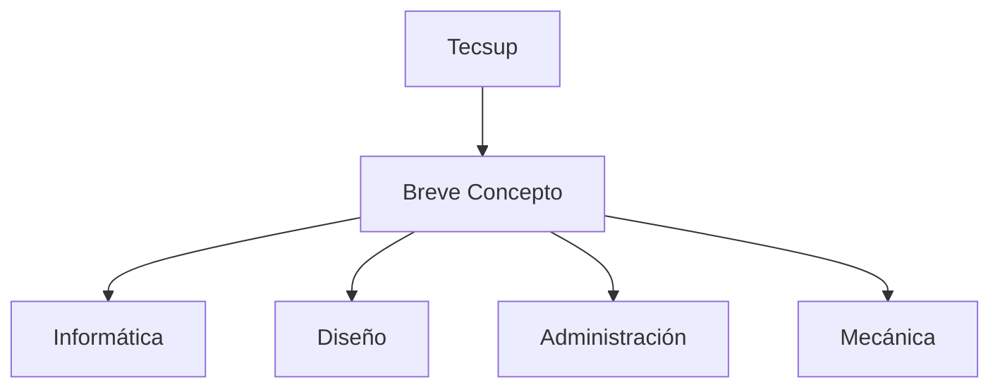

# Título Importante
Me encuentro aprendiendo *Markdown* en las clases del profesor
Luis Pallin..
## Subtítulo 01
Aquí verificamos cómo formatear diferentes **tipos de texto**.
## Subtítulo 02
Podremos conocer diferentes tipos de formatos de textos
usando ~~Markdown~~.

### Subtítulo 03
[Google](https://www.google.com)
[Tecsup](https://www.tecsup.edu.pe)

## Colocar Imágenes


## Funciones
- [X] Registrar Alumno
- [X] Generar Matricula
- [ ] Campo Vacío
- [ ] Libre

## Creando Tablas
| Lenguaje de Programación | Creador |
| ------------------------ | ------- |
| Java |James Cosling |
| PHP  |Rasmus Lerdorf|
| Python | Guido Van Rossum |

## Código
```html
<h1>Hola Mundo</h1>
```

```css
body{
    background:"red";
}
```

```java
public class Main {
    public static void main(String[] args){
        System.out.println("Hola Mundo Java");        
    }
}
```

```javascript
console.log("Hola Mundo Javascript");
```

## Mermaid Diagramas


