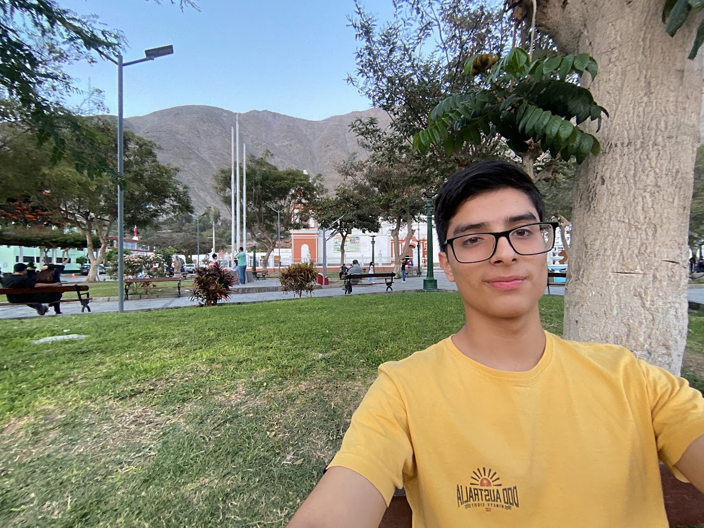

# Título Importante
Me encuentro aprendiendo *Markdown* en las clases del profesor
Luis Pallin..
## Subtítulo 01
Aquí verificamos cómo formatear diferentes **tipos de texto**.
## Subtítulo 02
Podremos conocer diferentes tipos de formatos de textos
usando ~~Markdown~~.

### Subtítulo 03
[Google](https://www.google.com)
[Tecsup](https://www.tecsup.edu.pe)

## Colocar Imágenes

## Funciones
- [X] Registrar Alumno
- [X] Generar Matricula
- [ ] Campo Vacío
- [ ] Libre